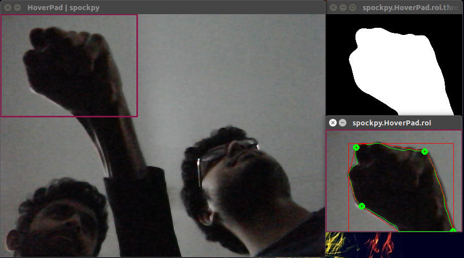
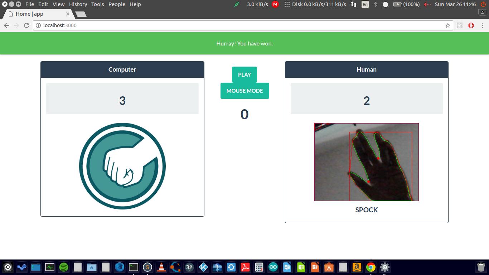

# [spockpy](http://spockpy.readthedocs.io) :fist: :hand: :v: :point_up:
> *"A Python hand gesture recognition library for Kinetic User Interface (KUI)."*

[](http://spockpy.readthedocs.io/en/latest/?badge=latest)


## Table of Contents
* [Installation](#installation)
* [Requirements](#Requirements)
* [Usage](#usage)
* [Examples](#examples)
* [Integration](#integration)
* [License](#license)

### Installation
##### 1. Download the repository

Clone the base repository onto your desktop with `git` as follows:
```console
$ git clone git@github.com:achillesrasquinha/spockpy
```

##### 2. Install necessary dependencies
spockpy is primarily built on [OpenCV](http://opencv.org) for a large number of standard Computer Vision helpers and techniques. In order to install spockpy, you may have to build OpenCV (2.x or 3.x, depending on your Python version) first.

For Linux users, use our build scripts as follows:
```console
$ chnmod +x build/*
$ build/get-opencv.sh
```

Next, install necessary Python dependencies as follows:
```console
$ pip install -r requirements.txt
```

Finally, go ahead and install spockpy onto your system.
```console
$ python setup.py install
```

To check whether you've installed spockpy, simply `import` spockpy:
```python
>>> import spockpy
```

Come this far? You have my [Vulcan Salute!](https://en.wikipedia.org/wiki/Vulcan_salute)


### Requrirements
spockpy requires a robust WebCamera to get going! There are no other requirements. You are now, requirement-less.

### Usage
spockpy creates a virtual trackpad (we call this, the *HoverPad*) for users to interact with the interface. Create a `spockpy.HoverPad` class as follows:
```python
>>> import spockpy
>>> pad = spockpy.HoverPad()
```

To display the `HoverPad`, use the `show` class method as follows:
```python
>>> pad.show()
```

That's it! `spockpy.HoverPad` releases a set of event objects from the `get_event` class method. You can now get `spockpy.Event` objects from frames of the current frame by simply:
```python
>>> event = pad.get_event()
>>> event.type == spockpy.Event.SPOCK
True
```

### Hand as a Mouse Pointer
`spockpy.Event` objects generate x, y coordinates of the tip of a user's index finger. :point_up_2: To get the current coordinates of a frame, simply:
```python
>>> event.get_tip()
(12, 40)
```
This retrives you a set of coordinates of the index finger relative to the screen.

### Examples
#### *How about Rock?*


#### *What about Paper?*


#### *Also, maybe Spock?*


### Integration
spockpy comes with a handy number of examples.
To launch the app, launch it as follows:
```python
>>> import spockpy
>>> app = spockpy.App()
>>> app.run()
```
OR via the command-line
```console
$ python -m spockpy
```




### License
This repository has been released under the [Apache License 2.0](LICENSE)
